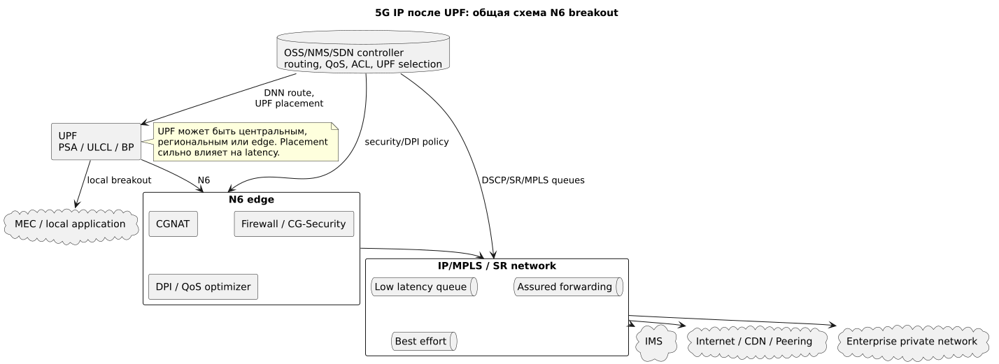
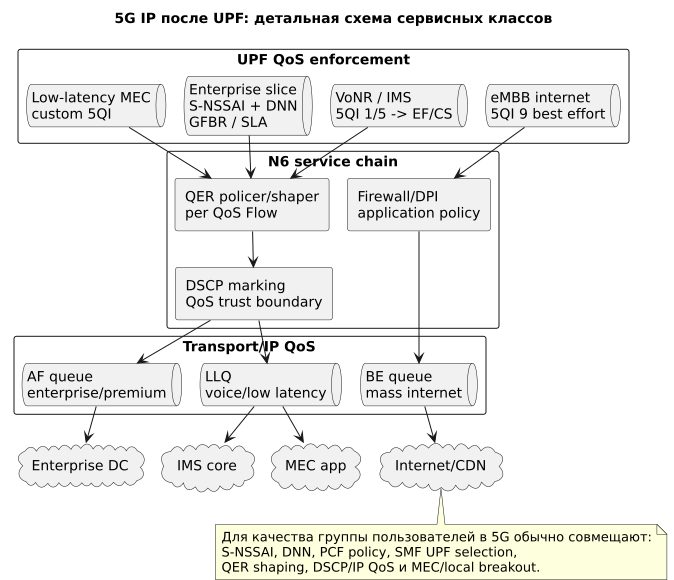

# 5G IP после UPF: N6, MEC, локальный breakout и IP QoS

## Общая схема



Источник: [5g-ip-common.puml](diagrams/src/5g-ip-common.puml)

## Детальная схема



Источник: [5g-ip-private.puml](diagrams/src/5g-ip-private.puml)

## Роль блока

После **UPF (User Plane Function)** трафик выходит в data network через интерфейс **N6**. В 5G этот блок гибче, чем LTE SGi: UPF может быть центральным, региональным или edge, а трафик может идти в internet, IMS, enterprise network или MEC.

Здесь решаются:

- где сделать breakout;
- как применить IP QoS;
- нужен ли CGNAT/firewall/DPI;
- куда вести enterprise или MEC-трафик;
- как сохранить маркировку QoS после UPF.

## Сокращения и зачем нужны

| Сокращение | Раскрытие | Зачем нужно |
|---|---|---|
| N6 | Interface from UPF to Data Network | Граница 5GC и внешней IP/data network. |
| PSA | PDU Session Anchor | UPF, который является IP-якорем сессии. |
| ULCL | Uplink Classifier | Функция UPF для разветвления uplink по правилам. |
| BP | Branching Point | Точка ветвления traffic steering. |
| MEC | Multi-access Edge Computing | Приложения ближе к RAN для низкой задержки. |
| LBO | Local Breakout | Локальный выход в интернет/сеть без дальнего hairpin. |
| SR | Segment Routing | Современное управление маршрутом в IP/MPLS/SRv6. |
| DSCP | Differentiated Services Code Point | IP-маркировка QoS. |
| QER | QoS Enforcement Rule | UPF-правило shaping/marking для QoS Flow. |
| CGNAT | Carrier-Grade NAT | Массовый NAT для public internet. |
| CDN | Content Delivery Network | Кэширование контента ближе к пользователю. |

## Где применяются политики

| Точка | Политика | Результат |
|---|---|---|
| SMF UPF selection | DNN, S-NSSAI, UE location, policy | Выбирает центральный/региональный/edge UPF. |
| UPF QER | rate limit, gating, DSCP marking | Применяет QoS per QoS Flow. |
| ULCL/BP | traffic steering | Отправляет часть трафика в MEC/enterprise, часть в internet. |
| N6 service chain | firewall, CGNAT, DPI, DDoS | Security и application control. |
| IP/MPLS/SR core | DSCP queues, routing, SLA paths | Сохраняет качество после UPF. |
| CDN/MEC | local content/application | Снижает latency и backbone load. |

## Механизмы качества для группы пользователей

### 1. Edge UPF и MEC

Для low-latency групп качество повышается размещением UPF ближе к RAN:

```text
UE -> gNB -> regional/edge UPF -> MEC app
```

Это сокращает RTT и уменьшает зависимость от центрального backbone.

### 2. DNN + S-NSSAI + UPF selection

Комбинация DNN и slice задает маршрут:

```text
enterprise DNN + enterprise slice -> dedicated UPF -> private DC
internet DNN + eMBB slice -> central/regional UPF -> CGNAT/CDN
mec DNN + low latency slice -> edge UPF -> MEC
```

### 3. QER и DSCP

SMF устанавливает на UPF **QER (QoS Enforcement Rule)**. UPF может:

- ограничить bitrate;
- маркировать DSCP;
- открыть/закрыть gate;
- разделить потоки по QoS Flow.

Далее IP/MPLS должен уважать DSCP или переустанавливать его на trust boundary.

### 4. Service chaining

Для разных групп можно включать разную цепочку:

- mass internet: CGNAT + firewall + CDN/peering;
- enterprise: firewall context + private routing;
- premium: assured forwarding queue;
- child/regulated: DPI/parental control;
- critical: low-latency path without heavy DPI, если разрешено security policy.

### 5. CDN и peering

Даже в 5G высокий 5QI не решает плохой интернет-маршрут. Для массовых групп часто эффективнее:

- local CDN;
- direct peering;
- regional breakout;
- оптимизация BGP/SR paths.

## Голос против data

IMS/VoNR трафик должен попадать в low-latency класс после UPF. Массовый internet идет через best effort/service chain. Для enterprise или MEC низкая задержка достигается не только приоритетом, но и правильным placement UPF и локальным маршрутом.

## Где хранится и как управляется конфигурация

| Конфигурация | Где хранится | Кто управляет |
|---|---|---|
| UPF selection, DNN route, ULCL/BP | SMF config/OSS | Packet core |
| QER/DSCP runtime rules | UPF, установлены SMF | Runtime policy |
| N6 firewall/DPI/CGNAT | Security/DPI/NAT managers | Security/IP services |
| IP/MPLS/SR QoS | Router configs, NMS/SDN controller | IP/MPLS team |
| MEC application routing | MEC orchestrator, DNS, SMF/UPF policy | Edge/cloud team |
| CDN/peering | CDN platforms, BGP policy | Backbone/peering team |

Критичный принцип: если UPF выбран далеко от пользователя, RAN и 5QI могут защитить radio delay, но не уберут backbone latency. Для low latency нужны gNB scheduling, edge UPF, local route и IP QoS вместе.
