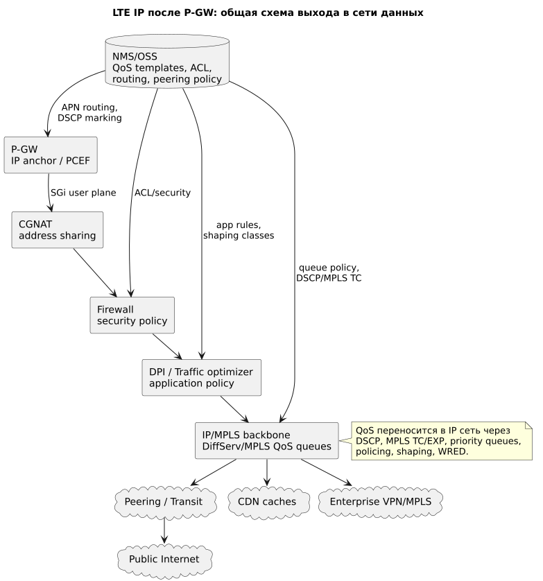
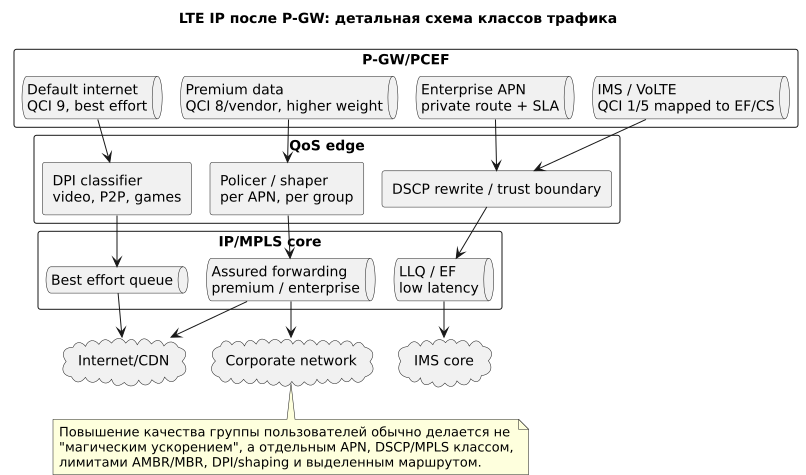

# LTE IP после P-GW: SGi, IP/MPLS, CGNAT, DPI и интернет

## Общая схема



Источник: [lte-ip-common.puml](diagrams/src/lte-ip-common.puml)

## Детальная схема



Источник: [lte-ip-private.puml](diagrams/src/lte-ip-private.puml)

## Роль блока

После **P-GW (Packet Data Network Gateway)** LTE-трафик выходит в обычную IP-сеть оператора через интерфейс **SGi**. Здесь уже работают не мобильные bearers, а IP/MPLS-механизмы: routing, QoS queues, CGNAT, firewall, DPI, peering, CDN и enterprise VPN.

Этот домен важен, потому что RAN и EPC могут правильно приоритизировать трафик, но качество все равно деградирует, если после P-GW есть congestion без QoS.

## Сокращения и зачем нужны

| Сокращение | Раскрытие | Зачем нужно |
|---|---|---|
| SGi | LTE interface from P-GW to packet data network | Граница между EPC и внешней IP-сетью. |
| CGNAT | Carrier-Grade Network Address Translation | Массовый NAT для абонентских private IPv4. |
| DPI | Deep Packet Inspection | Классификация приложений, shaping, charging, parental control. |
| DSCP | Differentiated Services Code Point | Маркировка IP QoS-класса в заголовке IP. |
| MPLS TC/EXP | MPLS Traffic Class / Experimental bits | Маркировка QoS в MPLS-сети. |
| WRED | Weighted Random Early Detection | Управляемый drop для борьбы с congestion. |
| LLQ | Low Latency Queue | Очередь для voice/real-time трафика. |
| CDN | Content Delivery Network | Кэширование контента ближе к абоненту. |
| BGP | Border Gateway Protocol | Маршрутизация к интернету, peers, transit. |
| DDoS | Distributed Denial of Service | Защита от атак и аномалий трафика. |

## Где применяются политики

| Точка | Политика | Результат |
|---|---|---|
| P-GW/PCEF | DSCP marking, APN route, rate limit | Передает класс трафика в IP-домен. |
| CGNAT | NAT pools, per-user/session limits | Масштабирует IPv4 и ограничивает abuse. |
| Firewall | ACL, stateful policy, lawful/security controls | Защищает edge и сервисы. |
| DPI/optimizer | app class, shaping, zero-rating, video policy | Управляет массовым data-трафиком. |
| IP/MPLS core | DSCP/MPLS queues, policing, WRED | Сохраняет приоритет через backbone. |
| Peering/CDN | route preference, cache placement | Снижает latency и transit congestion. |

## Механизмы качества для группы пользователей

### 1. Сохранение QoS-маркировки

P-GW может переписать или выставить DSCP по APN/QCI/service. IP-сеть должна либо доверять этой маркировке на trust boundary, либо переустанавливать ее на edge.

Пример:

```text
VoLTE/IMS -> EF/CS queue
enterprise APN -> assured forwarding
default internet -> best effort
```

### 2. Очереди и shaping в IP/MPLS

Для групп пользователей применяют:

- priority queue для real-time;
- assured forwarding для enterprise/premium;
- best effort для массового internet;
- policer/shaper per APN или per service;
- WRED для controlled drop до полного заполнения очередей.

### 3. DPI и application-aware policy

DPI может классифицировать:

- video streaming;
- social;
- gaming;
- VoIP;
- P2P;
- tethering;
- enterprise apps.

С ростом HTTPS/QUIC/ECH точность DPI снижается, поэтому надежнее использовать APN, dedicated bearer, enterprise route, DNS/SNI где доступно, или application signaling через PCRF.

### 4. CDN и peering

Качество массового data часто лучше повышается не приоритетом, а сокращением пути:

- local CDN caches;
- direct peering с крупными content providers;
- региональный breakout;
- правильная BGP policy.

### 5. Enterprise route

Для корпоративных групп трафик можно вести не в public internet, а в:

- IPsec/GRE tunnel;
- MPLS L3VPN;
- private cloud interconnect;
- dedicated firewall context.

## Голос против data

В LTE голосовой RTP обычно идет не в public internet, а в IMS-домен. После P-GW/IMS edge он должен сохранять low-latency queue. Массовая data-сеть проходит через CGNAT/DPI/CDN/peering и может быть shaping/deprioritized при congestion.

## Где хранится и как управляется конфигурация

| Конфигурация | Где хранится | Кто управляет |
|---|---|---|
| APN route, DSCP marking | P-GW config/OSS | Packet core |
| NAT pools, subscriber/session limits | CGNAT platform | IP services |
| Firewall/security policy | FW manager/OSS | Security/NOC |
| DPI rules, shaping profiles | DPI/PCEF/traffic optimizer | Policy/IP services |
| IP/MPLS QoS queues | Router configs, NMS, SDN controller | IP/MPLS team |
| Peering/CDN policy | BGP routers, peering DB, CDN portals | IP backbone/peering team |

Главный контрольный принцип: QoS должен быть end-to-end. После P-GW действуют IP-механизмы DSCP/MPLS queues, policing и shaping; ARP не передается в IP-домен, а QCI должен быть явно преобразован в IP QoS-класс.
