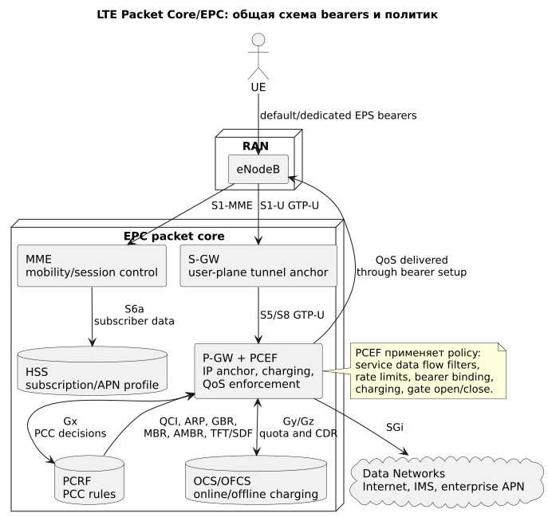
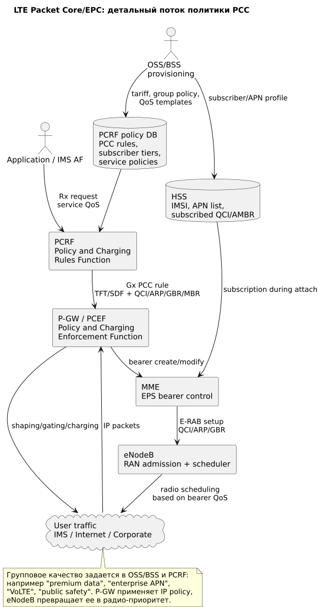

# LTE Packet Core/EPC: bearers, PCRF и P-GW

## Общая схема



Источник: [lte-packet-common.puml](diagrams/src/lte-packet-common.puml)

## Детальная схема



Источник: [lte-packet-private.puml](diagrams/src/lte-packet-private.puml)

## Роль блока

**EPC (Evolved Packet Core)** создает IP-сессию абонента, назначает **EPS bearers**, выбирает **APN (Access Point Name)** и передает в RAN параметры QoS.

В LTE packet core решает:

- какой APN доступен абоненту;
- какой default bearer создать;
- нужен ли dedicated bearer;
- какие QCI/ARP/GBR/MBR назначить;
- какие лимиты скорости и charging rules применить;
- куда маршрутизировать трафик после P-GW.

## Сокращения и зачем нужны

| Сокращение | Раскрытие | Зачем нужно |
|---|---|---|
| EPC | Evolved Packet Core | Пакетное ядро LTE. |
| MME | Mobility Management Entity | Control plane: attach, bearer control, mobility. |
| S-GW | Serving Gateway | User-plane anchor между eNodeB и P-GW. |
| P-GW | Packet Data Network Gateway | IP anchor, выход в APN/Internet, enforcement. |
| PCEF | Policy and Charging Enforcement Function | Функция P-GW, применяет PCC rules. |
| PCRF | Policy and Charging Rules Function | Центр policy decision в LTE. |
| PCC | Policy and Charging Control | Архитектура policy + charging. |
| EPS bearer | Evolved Packet System bearer | Логический канал с QoS от UE до P-GW. |
| EBI | EPS Bearer Identity | Идентификатор EPS bearer, нужен UE/core для различения bearers. |
| Default bearer | Default EPS bearer | Создается при подключении к APN, обычно internet best effort. |
| Dedicated bearer | Dedicated EPS bearer | Дополнительный bearer для конкретного сервиса/QoS. |
| TFT | Traffic Flow Template | IP-фильтры, связывающие поток с bearer. |
| SDF | Service Data Flow | Классифицированный поток сервиса для PCC. |
| APN-AMBR | APN Aggregate Maximum Bit Rate | Суммарный лимит скорости по APN. |
| UE-AMBR | UE Aggregate Maximum Bit Rate | Суммарный лимит скорости UE. |
| OCS/OFCS | Online/Offline Charging System | Квоты, charging, CDR. |
| HSS | Home Subscriber Server | Подписка, APN profile, subscriber data. |

## Где применяются политики

| Точка | Что применяет | Результат |
|---|---|---|
| HSS | subscription, разрешенные APN, AMBR, профиль сервиса | Определяет, какие услуги абонент вообще может получить. |
| PCRF | PCC rules, service policy, тарифная группа | Принимает решение о QCI/ARP/GBR, charging и gating. |
| P-GW/PCEF | TFT/SDF filters, rate limit, charging, bearer binding | Привязывает IP-потоки к bearer и ограничивает/разрешает трафик. |
| MME | bearer setup/modify, E-RAB control | Доставляет QoS-параметры в eNodeB. |
| eNodeB | E-RAB/QCI parameters | Применяет QoS уже в радио. |

## Механизмы качества для группы пользователей

### 1. APN как граница сервиса

Для разных групп можно выделить разные APN:

```text
internet.operator     -> массовый интернет
ims                   -> VoLTE/IMS
corp.company          -> enterprise route/SLA
iot.operator          -> IoT policy
```

APN позволяет задать отдельные P-GW, firewall, routing, charging, AMBR и QoS policy.

### 2. PCRF policy groups

В PCRF задаются группы:

- default consumer;
- premium data;
- enterprise;
- public safety;
- VoLTE;
- IoT.

Для каждой группы задаются PCC rules: QCI, ARP, MBR, GBR, APN-AMBR, gating, charging key.

### 3. Dedicated bearer

Dedicated bearer нужен, когда конкретный сервис должен иметь отдельную QoS-судьбу.

Пример:

```text
QCI 9 default bearer -> web/video/social
QCI 5 dedicated bearer -> IMS SIP signaling
QCI 1 dedicated bearer -> VoLTE RTP
```

Один UE может одновременно иметь несколько EPS bearers с разными QCI. В uplink UE использует TFT, чтобы выбрать bearer для пакета; в downlink P-GW/PCEF классифицирует поток по SDF/TFT и отправляет его в нужный bearer. Подробная схема: [Несколько QoS-каналов на одном UE](ue-multiple-qos-channels.md).

### 4. TFT/SDF classification

TFT/SDF фильтры связывают поток с bearer:

- IP destination/source;
- protocol;
- port;
- application signaling from IMS AF;
- service identifier.

Без корректной классификации трафик останется в default bearer и не получит нужный QoS.

### 5. AMBR/MBR/GBR

- **GBR** задает целевой минимум для GBR bearer после успешного RAN admission control и при достаточной емкости соты.
- **MBR** ограничивает максимум bearer.
- **APN-AMBR/UE-AMBR** ограничивает суммарную скорость.

Высокий AMBR не равен высокому приоритету: порядок обслуживания пакетов задают QCI и scheduler profile. ARP влияет на допуск, удержание и вытеснение bearer, но не ускоряет каждый пакет в MAC scheduler.

## Голос против data

VoLTE работает через IMS и PCC:

1. UE регистрируется в IMS.
2. IMS AF сообщает PCRF, что нужен голосовой media flow.
3. PCRF отдает P-GW/PCEF правило для dedicated bearer.
4. MME/eNodeB создают E-RAB с QCI 1.
5. eNodeB планирует голос выше, чем QCI 9 data.

Data-сеть обычно идет через default bearer QCI 9 или другой non-GBR QCI. Ее можно улучшать для групп через APN, PCRF policy и AMBR, но строгая гарантия появляется только с dedicated/GBR bearer и admission control в RAN.

## Где хранится и как управляется конфигурация

| Конфигурация | Где хранится | Кто управляет |
|---|---|---|
| Подписка, разрешенные APN, AMBR | HSS, BSS/CRM | Provisioning / BSS |
| PCC rules, тарифные группы, service policy | PCRF policy database | Packet core / policy team |
| APN routing, P-GW pool, NAT/security hooks | P-GW/PGW-C, EPC OSS | Packet core engineering |
| Charging keys, quotas | OCS/OFCS | Charging/Billing |
| IMS service trigger | IMS/AF | Voice/IMS team |

Управление обычно идет через BSS/CRM, product catalog, provisioning bus и vendor OSS/API. В runtime PCRF принимает решение по subscriber group, APN, service flow и текущему charging state.
