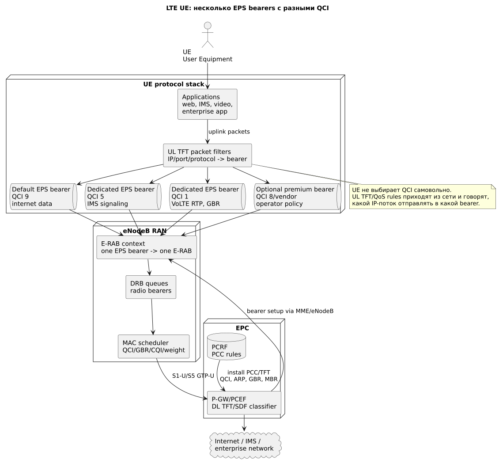
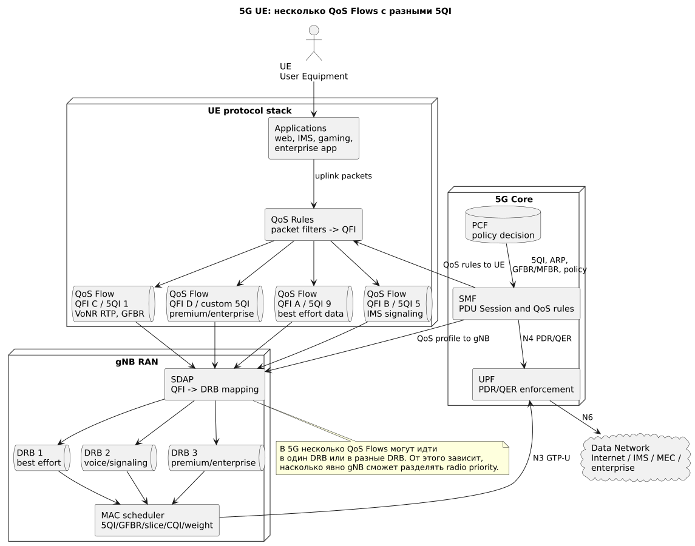

# Несколько QoS-каналов на одном UE

## Короткий ответ

Да, на одном **UE (User Equipment)** может одновременно существовать несколько логических QoS-каналов для разных типов трафика.

В LTE это обычно:

```text
несколько EPS bearers с разными QCI
```

В 5G это:

```text
несколько QoS Flows с разными 5QI
```

Важно: здесь "канал" означает логическую QoS-сущность. На уровне core это **EPS bearer** в LTE или **QoS Flow** в 5G. **DRB (Data Radio Bearer)** — radio transport: в LTE он обычно соответствует bearer 1:1, а в 5G через SDAP может переносить один или несколько QoS Flows. Это не отдельная физическая радиочастота для каждого приложения. Все потоки UE конкурируют за общие radio resources соты, а **eNodeB/gNB scheduler** решает, какие radio queues обслужить первыми.

## LTE-схема



Источник: [ue-multiple-qci-lte.puml](diagrams/src/ue-multiple-qci-lte.puml)

## 5G-схема



Источник: [ue-multiple-qos-5g.puml](diagrams/src/ue-multiple-qos-5g.puml)

## Сокращения и зачем нужны

| Сокращение | Полное имя | Краткая справка зачем нужно |
|---|---|---|
| UE | User Equipment | Смартфон, модем или CPE, на котором работают разные приложения. |
| QoS | Quality of Service | Механизмы качества: приоритет, задержка, потери, гарантированная/максимальная скорость. |
| EPS bearer | Evolved Packet System bearer | LTE-логический канал от UE до P-GW с одним QoS-профилем. |
| Default bearer | Default EPS bearer | Базовый LTE bearer для APN; обычно несет обычный internet data. |
| Dedicated bearer | Dedicated EPS bearer | Дополнительный LTE bearer для конкретного сервиса с отдельным QCI/ARP/GBR. |
| QCI | QoS Class Identifier | LTE-класс QoS для bearer: priority, delay budget, loss, GBR/non-GBR. |
| EBI | EPS Bearer Identity | Идентификатор EPS bearer в UE/core, нужен для различения bearers. |
| TFT | Traffic Flow Template | Набор IP-фильтров, который определяет, какой пакет относится к какому LTE bearer. |
| SDF | Service Data Flow | Классифицированный сервисный поток в PCC/PCRF/PCEF. |
| E-RAB | E-UTRAN Radio Access Bearer | Связка LTE EPS bearer с radio bearer и S1 bearer от eNodeB до EPC. |
| DRB | Data Radio Bearer | Радио bearer для пользовательских данных между UE и eNodeB/gNB. |
| P-GW | Packet Data Network Gateway | LTE IP anchor, классифицирует downlink и применяет PCEF policy. |
| PCEF | Policy and Charging Enforcement Function | Enforcement-функция P-GW: bearer binding, gating, charging, shaping. |
| PCRF | Policy and Charging Rules Function | LTE policy decision: решает, какие bearers и QCI нужны сервису. |
| APN | Access Point Name | LTE-имя сети данных: internet, ims, enterprise. |
| PDN Connection | Packet Data Network Connection | LTE-подключение UE к конкретному APN; внутри него есть default и dedicated bearers. |
| PDU Session | Protocol Data Unit Session | 5G-сессия UE к DNN; внутри нее могут быть несколько QoS Flows. |
| QoS Flow | Quality of Service Flow | Минимальная 5G-единица QoS с QFI и 5QI. |
| QFI | QoS Flow Identifier | Идентификатор 5G QoS Flow, переносится между UE/gNB/UPF. |
| 5QI | 5G QoS Identifier | 5G-класс QoS, аналог QCI по назначению. |
| QoS Rule | Quality of Service Rule | Правило на UE в 5G: packet filters и привязка uplink-пакетов к QFI. |
| PDR | Packet Detection Rule | UPF-правило для обнаружения пакетов в 5G downlink/uplink. |
| QER | QoS Enforcement Rule | UPF-правило для rate enforcement, marking и gating. |
| SDAP | Service Data Adaptation Protocol | 5G-уровень, который маппит QoS Flow/QFI в DRB. |
| ARP | Allocation and Retention Priority | Приоритет допуска/удержания bearer/flow и pre-emption. |
| GBR | Guaranteed Bit Rate | LTE-целевой minimum bitrate после успешного admission control и при достаточной емкости. |
| GFBR | Guaranteed Flow Bit Rate | 5G-целевой minimum bitrate QoS Flow после successful admission и при достаточной емкости. |
| AMBR | Aggregate Maximum Bit Rate | Суммарный лимит скорости UE/APN/session; не является radio scheduling priority. |

## LTE: как один UE получает несколько QCI

В LTE у UE может быть несколько **EPS bearers**. Каждый EPS bearer имеет один QoS-профиль, включая **QCI (QoS Class Identifier)**.

Типовая картина:

```text
UE
  -> default bearer, QCI 9: ordinary internet
  -> dedicated bearer, QCI 5: IMS signaling
  -> dedicated bearer, QCI 1: VoLTE RTP
  -> optional dedicated/default policy bearer, QCI 8/operator-defined: premium data
```

### Как создается

1. UE подключается к **APN (Access Point Name)**.
2. EPC создает **Default EPS bearer** для этого APN.
3. **PCRF (Policy and Charging Rules Function)** или IMS/application trigger решает, что нужен отдельный service QoS.
4. **P-GW/PCEF (Packet Data Network Gateway / Policy and Charging Enforcement Function)** устанавливает PCC/TFT rules.
5. **MME (Mobility Management Entity)** инициирует bearer setup/modify.
6. **eNodeB (evolved NodeB)** создает **E-RAB (E-UTRAN Radio Access Bearer)** и **DRB (Data Radio Bearer)** с нужным QCI.

### Как UE понимает, куда отправлять uplink

UE получает **TFT (Traffic Flow Template)**:

```text
IP destination/source
protocol
port
packet filter precedence
```

TFT говорит UE:

```text
SIP signaling -> bearer QCI 5
RTP voice -> bearer QCI 1
ordinary TCP/UDP internet -> bearer QCI 9
enterprise flow -> bearer QCI 8/operator-defined non-GBR или GBR QCI для SLA
```

Если пакет не совпал с dedicated bearer TFT, он обычно идет в default bearer.

### Как downlink попадает в нужный bearer

В downlink классификацию делает P-GW/PCEF:

```text
Internet/IMS packet
  -> PCEF SDF/TFT classification
  -> selected EPS bearer
  -> S-GW/eNodeB
  -> DRB queue
  -> MAC scheduler
```

## 5G: аналог через QoS Flows

В 5G термин **QCI** не используется для новых 5G-сессий; его роль выполняет **5QI (5G QoS Identifier)**.

У одного UE может быть одна **PDU Session** с несколькими **QoS Flows** для одного **DNN (Data Network Name)**:

```text
PDU Session: DNN internet
  -> QoS Flow QFI A, 5QI 9: best effort
  -> QoS Flow QFI D, custom 5QI: premium application
```

Если UE одновременно использует разные DNN, например `internet`, `ims` и `enterprise`, это обычно несколько PDU Sessions. Внутри каждой PDU Session могут быть свои QoS Flows.

### Как создается

1. UE регистрируется в 5GC.
2. **SMF (Session Management Function)** создает PDU Session.
3. **PCF (Policy Control Function)** выдает policy: 5QI, ARP, GFBR/MFBR, Session-AMBR.
4. SMF передает UE **QoS Rules** для uplink classification.
5. SMF передает gNB QoS profile.
6. **UPF (User Plane Function)** получает **PDR (Packet Detection Rule)** и **QER (QoS Enforcement Rule)**.
7. **SDAP (Service Data Adaptation Protocol)** в gNB/UE маппит QFI в DRB.

### Важный нюанс SDAP/DRB

В 5G несколько QoS Flows могут:

```text
вариант A: идти в разные DRB
вариант B: быть сгруппированы в один DRB
```

Если critical и best effort flows попали в один DRB, radio-изоляция слабее. Если они разнесены по DRB, gNB scheduler может точнее применять разные приоритеты и discard policies.

## Что именно приоритизируется в RAN

RAN не приоритизирует "приложение" напрямую. RAN видит radio bearers, QoS class и очереди:

```text
LTE: EPS bearer -> E-RAB -> DRB -> RLC/MAC queue
5G: QoS Flow -> SDAP mapping -> DRB -> RLC/MAC queue
```

**MAC scheduler (Medium Access Control scheduler)** учитывает:

- QCI/5QI priority;
- delay budget;
- GBR/GFBR debt;
- admission state; ARP уже применен на этапе допуска/удержания QoS Flow или bearer;
- radio conditions: CQI/SINR;
- fairness;
- scheduler weight;
- slice quota в 5G.

## Пример: одно UE с голосом и интернетом

```text
UE одновременно:
  - разговаривает по VoLTE/VoNR
  - грузит файл
  - держит IMS signaling
```

LTE:

| Трафик | Bearer | QCI | Поведение |
|---|---|---:|---|
| IMS SIP signaling | Dedicated EPS bearer | 5 | Высокий приоритет signaling. |
| VoLTE RTP | Dedicated EPS bearer | 1 | GBR, low delay, защищается scheduler. |
| File download | Default EPS bearer | 9 | Best effort, замедляется при congestion. |

5G:

| Трафик | QoS Flow | 5QI | Поведение |
|---|---|---:|---|
| IMS SIP signaling | QFI для signaling | 5 | Высокий приоритет signaling. |
| VoNR RTP | QFI для voice | 1 | GFBR/low delay. |
| File download | QFI для default data | 9 | Best effort. |

## Может ли приложение само выбрать QCI

Обычно нет.

Приложение на UE может:

- открыть socket;
- использовать IP/port/protocol;
- иногда выставить DSCP;
- использовать operator SDK/API, если оператор такое предоставляет;
- инициировать IMS/enterprise signaling, которое известно сети.

Но QCI/5QI назначает сеть:

```text
LTE: PCRF/P-GW/MME/eNodeB
5G: PCF/SMF/UPF/gNB
```

DSCP от приложения обычно не считается надежным основанием для radio priority, если оператор явно не настроил trust policy.

## Практические ограничения

| Ограничение | Почему важно |
|---|---|
| Bearers/flows не создают новую radio capacity | Все равно используется общий PRB/slot ресурс соты. |
| Нужна классификация traffic flow | Без TFT/QoS Rules трафик останется в default bearer/flow. |
| Нужна поддержка UE и core | UE должен принять rules, core должен создать bearer/session. |
| Нужен RAN mapping | QCI/5QI должен быть связан с scheduler behavior в eNodeB/gNB. |
| Есть vendor limits | Количество bearers/flows/DRB ограничено реализацией и профилями. |
| GBR/GFBR требует admission control | Иначе guaranteed flows будут приняты сверх емкости и деградируют. |
| Шифрование приложений усложняет DPI | HTTPS/QUIC/ECH ухудшают application classification без явной policy. |

## Где хранится конфигурация

| Конфигурация | LTE | 5G |
|---|---|---|
| Разрешение на услугу | HSS, BSS/CRM | UDM/UDR, BSS/CRM |
| Policy decision | PCRF | PCF |
| Packet filters | TFT на UE и P-GW/PCEF | QoS Rules на UE, PDR на UPF |
| User-plane enforcement | P-GW/PCEF | UPF/QER |
| Radio mapping | eNodeB QCI -> DRB/scheduler profile | gNB 5QI/QFI -> DRB/scheduler profile |
| Групповой приоритет | APN, PCC group, QCI/scheduler weight; ARP для admission/retention, AMBR для лимита | DNN, S-NSSAI, policy group, 5QI/scheduler weight; ARP для admission/retention, Session-AMBR для лимита |

## Короткое резюме

Да, один UE может одновременно иметь несколько логических QoS-каналов для разных типов трафика.

В LTE:

```text
несколько EPS bearers с разными QCI
```

В 5G:

```text
несколько QoS Flows с разными 5QI/QFI
```

Это основной механизм, позволяющий одному устройству одновременно держать защищенный голос, signaling, premium/enterprise traffic и обычный best effort internet. Но приоритет работает только если есть end-to-end policy: packet filters, core policy, RAN mapping, scheduler configuration и достаточная radio capacity.
