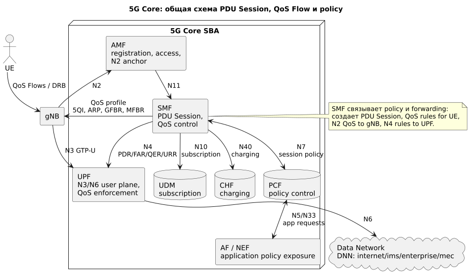
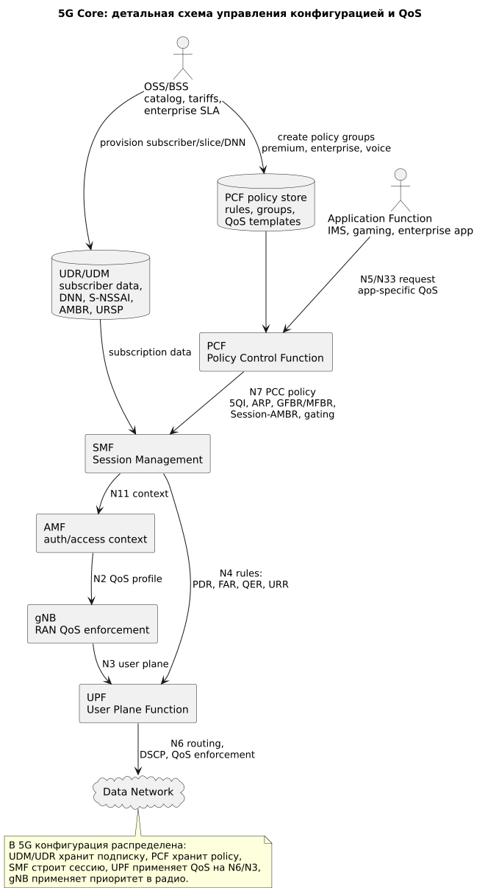

# 5G Packet Core: PDU Session, PCF, SMF и UPF

## Общая схема



Источник: [5g-packet-common.puml](diagrams/src/5g-packet-common.puml)

## Детальная схема



Источник: [5g-packet-private.puml](diagrams/src/5g-packet-private.puml)

## Роль блока

**5GC (5G Core)** создает **PDU Session**, назначает **DNN (Data Network Name)**, выбирает **UPF**, получает политики из **PCF** и доставляет QoS-параметры в gNB и UPF.

В отличие от LTE, 5G использует service-based architecture и более гибкое управление:

- QoS Flow вместо EPS bearer;
- 5QI вместо QCI;
- DNN и S-NSSAI вместо только APN;
- UPF placement для edge/local breakout;
- PCF/SMF/UPF разделяют decision, session control и enforcement.

## Сокращения и зачем нужны

| Сокращение | Раскрытие | Зачем нужно |
|---|---|---|
| 5GC | 5G Core | Пакетное ядро 5G. |
| AMF | Access and Mobility Management Function | Регистрация UE, access control, N2 anchor. |
| SMF | Session Management Function | PDU Session, QoS, UPF selection, N4 rules. |
| UPF | User Plane Function | User-plane forwarding, QoS enforcement, N6 breakout. |
| PCF | Policy Control Function | Policy decision для сессий и сервисов. |
| UDM/UDR | Unified Data Management / Unified Data Repository | Подписка, DNN, slice, URSP/subscriber data. |
| CHF | Charging Function | Charging в 5G. |
| AF | Application Function | Приложение, запрашивающее policy/QoS. |
| NEF | Network Exposure Function | Безопасное API-окно для внешних AF. |
| NSSF | Network Slice Selection Function | Выбор slice. |
| DNN | Data Network Name | Имя сети данных, аналог APN по смыслу. |
| PDU Session | Protocol Data Unit Session | Логическое подключение UE к DNN. |
| PDR | Packet Detection Rule | Правило UPF для обнаружения пакета. |
| FAR | Forwarding Action Rule | Правило UPF, куда переслать пакет. |
| QER | QoS Enforcement Rule | Правило UPF для rate/QoS enforcement. |
| URR | Usage Reporting Rule | Правило UPF для usage/charging reports. |
| URSP | UE Route Selection Policy | Политика UE для выбора DNN/slice/app route. |

## Где применяются политики

| Точка | Что применяет | Результат |
|---|---|---|
| UDM/UDR | subscription, DNN, S-NSSAI, Session-AMBR, URSP | Определяет доступные услуги и slice для UE. |
| PCF | policy rules, групповые профили, AF-запросы | Выдает session и QoS decisions для SMF. |
| SMF | PDU Session, UPF selection, QoS rules | Настраивает gNB через N2 и UPF через N4. |
| UPF | PDR/FAR/QER/URR | Применяет forwarding, shaping, marking, usage reporting. |
| gNB | 5QI/ARP/GFBR/MFBR, DRB mapping | Применяет radio scheduling. |

## Механизмы качества для группы пользователей

### 1. DNN как граница сервиса

Примеры:

```text
internet       -> public internet
ims            -> VoNR/IMS
enterprise     -> private route
mec            -> local edge app
iot            -> massive IoT policy
```

DNN задает routing, UPF pool, security chain, charging и базовые QoS constraints.

### 2. Network slicing через S-NSSAI

Slice позволяет отделить логическую сеть:

```text
eMBB slice        -> массовый broadband
enterprise slice  -> корпоративный SLA
public safety     -> высокий приоритет/pre-emption
URLLC-like slice   -> low latency design
```

Slice не гарантирует качество сам по себе; нужны RAN resource policy, UPF/IP QoS и admission control.

### 3. PCF policy groups

PCF может выдавать разные политики по:

- subscriber group;
- DNN;
- S-NSSAI;
- application identifier;
- roaming/home policy;
- charging state;
- time/location.

### 4. AF/NEF application-aware QoS

Приложение может запросить QoS через AF/NEF/PCF. Пример: enterprise app или gaming platform просит низкую задержку для конкретного flow. PCF решает, разрешено ли это абоненту и сети.

### 5. UPF QER enforcement

UPF применяет:

- shaping/policing per QoS Flow;
- DSCP marking;
- gating;
- usage reporting;
- branching/local breakout.

### 6. UPF selection

SMF выбирает UPF:

- центральный UPF для массового internet;
- региональный UPF для latency/capacity;
- edge UPF для MEC;
- dedicated UPF для enterprise/private network.

## Голос против data

VoNR использует IMS DNN/PDU Session и QoS Flows:

```text
5QI 5 -> IMS signaling
5QI 1 -> RTP voice
```

Data обычно идет через internet DNN с 5QI 9. При congestion PCF/SMF/gNB/UPF должны согласованно защищать IMS/voice и ограничивать eMBB best effort.

## Где хранится и как управляется конфигурация

| Конфигурация | Где хранится | Кто управляет |
|---|---|---|
| Subscription, DNN, S-NSSAI, Session-AMBR, URSP | UDM/UDR, BSS/CRM | Provisioning / product / core |
| Policy rules and groups | PCF policy store | Policy/core team |
| UPF pools, DNN routing, N4 profiles | SMF config/OSS | Packet core engineering |
| PDR/FAR/QER/URR runtime rules | UPF, installed by SMF | Runtime from SMF |
| Charging | CHF/Billing | Charging team |
| Slice selection | NSSF/AMF/UDM | Slicing/core team |

Практический контроль: изменение product/tariff обычно начинается в BSS/CRM, затем provisioning обновляет UDM/PCF, а в runtime SMF строит конкретную PDU Session и настраивает gNB/UPF.
