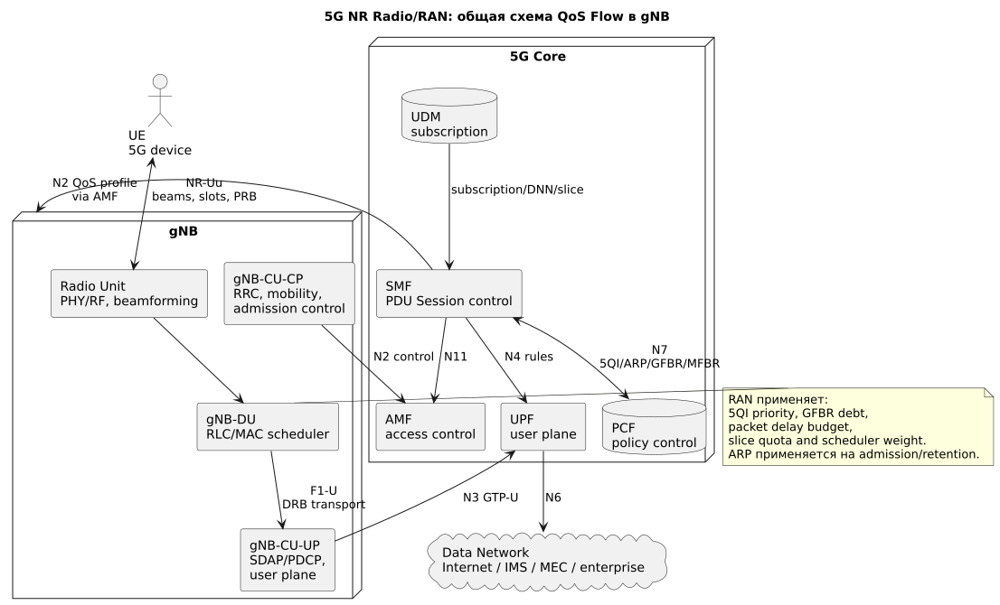
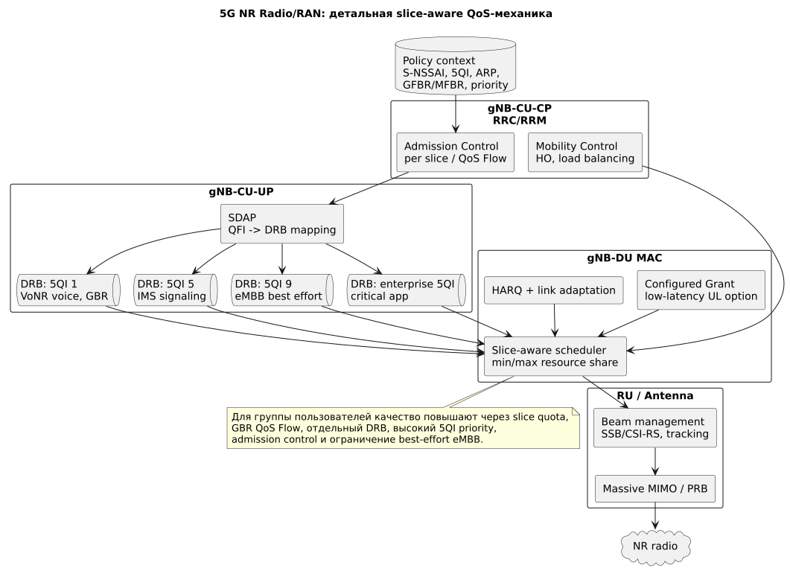

# 5G Radio/RAN: gNB, QoS Flow, slicing и radio scheduling

## Общая схема



Источник: [5g-radio-common.puml](diagrams/src/5g-radio-common.puml)

## Детальная схема



Источник: [5g-radio-private.puml](diagrams/src/5g-radio-private.puml)

## Роль блока

**5G RAN (5th Generation Radio Access Network)** управляет NR-радиодоступом. Узел **gNB (gNodeB)** может быть разделен на **CU-CP**, **CU-UP**, **DU** и **RU**. В 5G RAN появляется более явная связка QoS с service flows: **QoS Flow** с **QFI** маппится через **SDAP** в **DRB**.

Главное отличие от LTE: RAN может учитывать не только QoS-класс, но и **S-NSSAI (Single Network Slice Selection Assistance Information)** — идентификатор network slice.

## Сокращения и зачем нужны

| Сокращение | Раскрытие | Зачем нужно |
|---|---|---|
| gNB | gNodeB | Базовая станция 5G NR. |
| NR | New Radio | Радиоинтерфейс 5G. |
| CU-CP | Central Unit - Control Plane | RRC, mobility, N2 control. |
| CU-UP | Central Unit - User Plane | PDCP/user plane. |
| DU | Distributed Unit | RLC/MAC scheduler, ближе к радио. |
| RU | Radio Unit | PHY/RF, антенны, beamforming. |
| SDAP | Service Data Adaptation Protocol | Маппинг QoS Flow с QFI в DRB. |
| QoS Flow | Quality of Service Flow | Минимальная 5G-единица QoS. |
| QFI | QoS Flow Identifier | Метка QoS Flow. |
| QoS Rule | Quality of Service Rule | Правило UE, которое привязывает uplink packet filters к QFI. |
| 5QI | 5G QoS Identifier | 5G-класс QoS: priority, delay, loss. |
| GFBR | Guaranteed Flow Bit Rate | Гарантированная скорость QoS Flow. |
| MFBR | Maximum Flow Bit Rate | Максимальная скорость QoS Flow. |
| S-NSSAI | Single Network Slice Selection Assistance Information | Идентификатор slice. |
| CSI-RS | Channel State Information Reference Signal | Измерение канала/beam для scheduler. |
| SSB | Synchronization Signal Block | Синхронизация и beam sweeping. |
| BWP | Bandwidth Part | Часть полосы NR с отдельной numerology. |
| CG | Configured Grant | Uplink-ресурс без динамического запроса, полезен для low latency. |
| Gold-status | Commercial priority tier | Бизнес-статус, который в 5G должен быть преобразован в DNN/S-NSSAI/5QI/ARP/AMBR/scheduler weight. |

## Где применяются политики

| Точка | Что применяет | Как влияет |
|---|---|---|
| gNB-CU-CP admission | S-NSSAI, 5QI, ARP, GFBR, load | Принимает PDU session/QoS Flow, может отказать при перегрузке. |
| SDAP | QFI -> DRB mapping | Разделяет сервисы в разные DRB или группирует их. |
| gNB-DU MAC scheduler | 5QI priority, delay budget, GFBR debt, slice quota | Распределяет PRB/slots и защищает критичные flows. |
| Beam management | SSB/CSI-RS reports | Повышает SINR и снижает PRB cost. |
| Mobility/RRM | load, coverage, slice policy | Переводит UE между cells/layers/beams. |

## Механизмы качества для группы пользователей

### 1. QoS Flow и 5QI

В 5G вместо LTE dedicated bearer используется отдельный QoS Flow:

```text
QoS Flow: 5QI 1, GFBR, low delay -> VoNR
QoS Flow: 5QI 9, non-GBR -> mass internet
QoS Flow: custom 5QI, GFBR -> enterprise critical app
```

### 2. SDAP mapping в DRB

Если критичный QoS Flow попадает в отдельный DRB, gNB может точнее применять scheduler priority и discard timers. Если несколько flows объединены в один DRB, управление проще, но изоляция хуже.

### 3. Slice-aware scheduling

Для группы пользователей можно выделить slice:

```text
S-NSSAI enterprise -> минимальная доля ресурса
S-NSSAI public internet -> best effort pool
S-NSSAI public safety -> высокий приоритет и pre-emption
```

В реальных сетях возможности зависят от vendor RAN: scheduler weights, min/max resource share, admission thresholds per slice.

### 4. GFBR/MFBR и admission control

**GFBR** работает как гарантия только вместе с admission control. gNB/SMF не должны принимать больше guaranteed flows, чем radio может обслужить.

### 5. Beamforming и Massive MIMO

Для 5G mid-band/mmWave качество часто повышается через радиоэффективность:

- корректный beam selection/tracking;
- Massive MIMO;
- CSI-RS tuning;
- BWP/numerology profile;
- interference coordination;
- TDD pattern optimization.

### 6. Configured Grant для low latency

**Configured Grant** дает UE uplink-ресурс без ожидания динамического grant. Это полезно для малых задержек, но требует аккуратного resource planning, иначе фиксированные ресурсы будут простаивать.

## Несколько 5QI на одном UE

В 5G один UE может иметь несколько QoS Flows с разными 5QI/QFI внутри одной или нескольких PDU Sessions:

```text
5QI 9 -> ordinary internet
5QI 5 -> IMS signaling
5QI 1 -> VoNR RTP
custom 5QI -> premium/enterprise flow
```

Через SDAP gNB маппит QoS Flows в DRB. Несколько QoS Flows могут быть сгруппированы в один DRB или разнесены по разным DRB. Разнесение дает scheduler больше возможностей отделить voice/critical traffic от best effort data.

Подробное описание и схемы: [Несколько QoS-каналов на одном UE](ue-multiple-qos-channels.md).

## Gold-status в 5G RAN

В 5G gold-status обычно превращается в policy group в PCF и subscription/profile в UDM/UDR. gNB применяет не бизнес-метку, а технический QoS-контекст:

```text
BSS/CRM gold entitlement
  -> UDM/UDR DNN, S-NSSAI, AMBR, URSP
  -> PCF policy
  -> SMF PDU Session and QoS Flow
  -> gNB 5QI/ARP/GFBR/S-NSSAI context
```

Типовая реализация:

| Абонент/сервис | 5G сущность | 5QI | GFBR | Что делает gNB |
|---|---|---:|---|---|
| Default internet | QoS Flow | 9 | нет | Best effort eMBB scheduling. |
| Gold internet | QoS Flow | 8/custom | обычно нет | Более высокий scheduler weight и Session-AMBR. |
| Gold enterprise | QoS Flow в enterprise DNN/slice | custom/standard | да, если SLA | Slice-aware admission и protected resources. |
| VoNR | IMS QoS Flow | 1 + 5 | да для RTP | Low-delay scheduling выше gold data. |

Если vendor RAN поддерживает slice-aware scheduling, gold-группа может получить min/max resource share на S-NSSAI. Без такой поддержки gold чаще реализуется через 5QI priority, Session-AMBR и scheduler weights.

Подробная сквозная схема: [Gold-status в радио сети](gold-status.md).

## Голос против data

VoNR обычно использует IMS PDU Session и QoS Flow с 5QI 1 для RTP, 5QI 5 для IMS signaling. Массовый data обычно идет 5QI 9 non-GBR. При congestion gNB должен защищать VoNR/IMS и снижать throughput eMBB.

## Где хранится и как управляется конфигурация

| Конфигурация | Где хранится | Кто управляет |
|---|---|---|
| RAN slice profile, scheduler weights, admission thresholds | gNB EMS/NMS/OSS | RAN engineering |
| QoS Flow profile: 5QI, ARP, GFBR/MFBR | SMF/PCF runtime context | Core policy team |
| S-NSSAI availability, NSSAI per subscriber | UDM/UDR, NSSF/AMF policy | Core/slicing team |
| Beam/RF/HO parameters | RAN OSS/SON | RAN optimization |
| URSP influencing app/DNN/slice selection | UDM/PCF delivered to UE | Core policy/device team |

5G RAN применяет policy локально, но коммерческая логика обычно хранится в PCF/UDM/BSS, а radio-параметры — в RAN OSS.
