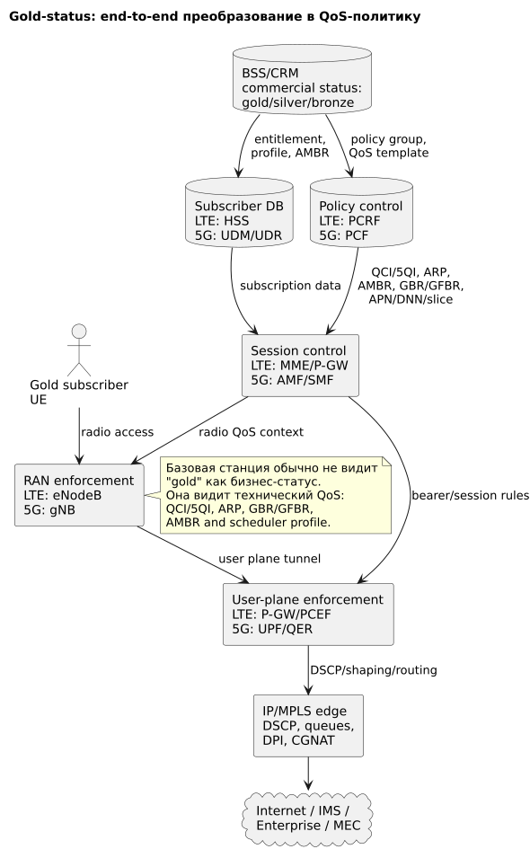
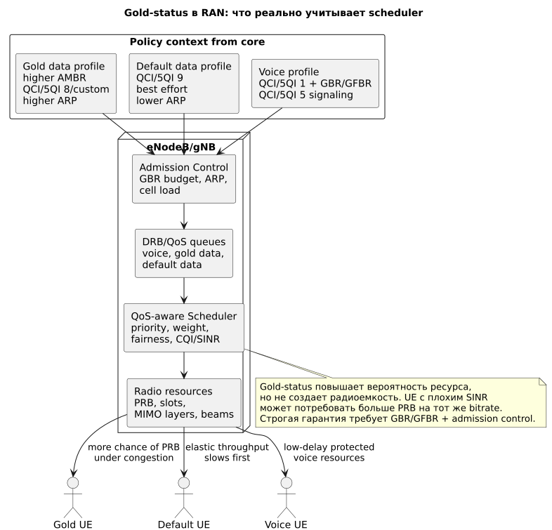

# Gold-status в радио сети: как коммерческий приоритет превращается в QoS

## Общая схема



Источник: [gold-status-common.puml](diagrams/src/gold-status-common.puml)

## Детальная RAN-схема



Источник: [gold-status-ran-detail.puml](diagrams/src/gold-status-ran-detail.puml)

## Главная идея

**Gold-status** — это не стандартный 3GPP radio-параметр. Обычно это коммерческий профиль абонента или группы абонентов, который в сети должен быть преобразован в технические параметры QoS.

```text
Gold-status в BSS/CRM
  -> entitlement в HSS/UDM
  -> policy group в PCRF/PCF
  -> bearer/PDU Session policy
  -> QCI/5QI, ARP, AMBR, GBR/GFBR, APN/DNN/slice
  -> eNodeB/gNB scheduler behavior
```

Базовая станция обычно не принимает решение "это gold-клиент". Она получает QoS-контекст и применяет его как radio policy.

## Сокращения и зачем нужны

| Сокращение | Раскрытие | Зачем нужно |
|---|---|---|
| Gold-status | Commercial priority tier | Коммерческий статус абонента: premium/gold/silver/bronze. Сам по себе не является radio QoS. |
| BSS/CRM | Business Support System / Customer Relationship Management | Хранит тариф, статус клиента и entitlement. |
| HSS | Home Subscriber Server | LTE-подписка: APN, AMBR, service eligibility. |
| UDM/UDR | Unified Data Management / Repository | 5G-подписка: DNN, S-NSSAI, Session-AMBR, URSP. |
| PCRF | Policy and Charging Rules Function | LTE policy decision: назначает PCC rules. |
| PCF | Policy Control Function | 5G policy decision: назначает session/QoS rules. |
| QCI | QoS Class Identifier | LTE-класс QoS, по которому RAN понимает приоритет data/voice. |
| 5QI | 5G QoS Identifier | 5G-класс QoS для QoS Flow. |
| ARP | Allocation and Retention Priority | Приоритет допуска/удержания bearer/flow и pre-emption. |
| AMBR | Aggregate Maximum Bit Rate | Суммарный лимит скорости. Повышает потолок, но сам не гарантирует ресурс. |
| GBR/GFBR | Guaranteed Bit Rate / Guaranteed Flow Bit Rate | Минимальная гарантированная скорость для bearer/QoS Flow. |
| Scheduler weight | Vendor-specific scheduling weight | Вес в RAN scheduler, определяет долю ресурса при конкуренции. |
| SPID | Subscriber Profile ID | Vendor/3GPP-used profile identifier для subscriber-based RAN handling в некоторых реализациях. |

## Что gold-status может дать в RAN

| Механизм | Как работает | Что дает | Ограничение |
|---|---|---|---|
| Более высокий AMBR | В HSS/UDM задается больший UE/APN/Session-AMBR | Gold user может получить более высокую скорость, когда сеть свободна | При перегрузке AMBR без scheduler priority почти не помогает |
| Лучший QCI/5QI | Gold data получает QCI/5QI с более высоким priority level | Scheduler может отличить gold data от default data | Нужно корректное маппирование в RAN vendor profile |
| Scheduler weight | eNodeB/gNB дает gold-классу больший вес | При congestion gold получает большую долю PRB | Vendor-specific, требует RAN-настройки |
| Более высокий ARP | Bearer/flow легче принять и сложнее вытеснить | Лучше сохраняет сессию при дефиците ресурсов | ARP не ускоряет каждый пакет |
| Dedicated bearer / QoS Flow | Для конкретного сервиса создается отдельная QoS-сущность | Сервис gold-клиента отделяется от best effort | Сложно применять ко всему интернету |
| GBR/GFBR | Сеть обещает минимальный bitrate | Реальная гарантия для критичного сервиса | Нужен admission control и емкость |
| Slice/DNN/APN | Gold-группа уходит в отдельный service boundary | Удобно для enterprise/premium/5G slicing | Требует end-to-end настройки core/RAN/IP |

## LTE-реализация

В LTE gold-status обычно реализуется через HSS, PCRF и P-GW/PCEF.

```text
UE attach
  -> MME получает subscription из HSS
  -> P-GW обращается к PCRF
  -> PCRF видит gold policy group
  -> P-GW/PCEF получает PCC rule
  -> default/dedicated bearer получает QCI/ARP/AMBR/GBR
  -> eNodeB применяет QCI/ARP/GBR в admission и scheduler
```

Типовые варианты:

| Класс | Bearer | QCI | GBR | ARP | Radio behavior |
|---|---|---:|---|---|---|
| Default internet | default bearer | 9 | нет | низкий | Best effort, деградирует первым. |
| Gold internet | default bearer или отдельный APN | 6/8 или vendor mapping | обычно нет | выше default | Более высокий scheduler weight при congestion. |
| Gold service | dedicated bearer | 3/6/8/custom | опционально | выше | Отдельная QoS-обработка сервиса. |
| VoLTE | dedicated bearer | 1 + 5 | да для RTP | высокий | Защищенный голос, выше gold data. |

## 5G-реализация

В 5G gold-status обычно реализуется через UDM/UDR, PCF, SMF, UPF и gNB.

```text
UE registration
  -> AMF/SMF получают subscription из UDM
  -> PCF выдает policy по gold group
  -> SMF создает PDU Session и QoS Flow
  -> SMF ставит QER на UPF
  -> gNB получает 5QI/ARP/GFBR/S-NSSAI
  -> scheduler применяет radio priority
```

Типовые варианты:

| Класс | 5G сущность | 5QI | GFBR | Slice/DNN | Radio behavior |
|---|---|---:|---|---|---|
| Default internet | QoS Flow | 9 | нет | internet/eMBB | Best effort. |
| Gold internet | QoS Flow | 8/custom | обычно нет | internet или premium DNN | Higher weight, higher AMBR. |
| Gold enterprise | QoS Flow | custom/standard | да, если SLA | enterprise DNN + S-NSSAI | Protected resource/admission. |
| VoNR | IMS QoS Flow | 1 + 5 | да для RTP | ims | Защищенный голос. |

## Что происходит при перегрузке соты

При congestion RAN scheduler учитывает:

- QoS class: QCI/5QI;
- delay budget;
- GBR/GFBR debt;
- scheduler weight;
- CQI/SINR и radio efficiency;
- ARP/admission state;
- slice quota;
- fairness между UE.

Упрощенный порядок:

```text
Emergency / public safety
  -> IMS signaling
  -> VoLTE/VoNR
  -> critical GBR enterprise
  -> gold data / premium non-GBR
  -> default data
  -> background / low priority
```

Gold-status повышает вероятность получить PRB при конкуренции, но не создает новую емкость. Если gold UE находится на краю соты и имеет плохой SINR, каждый мегабит требует больше PRB, поэтому фактическая скорость может быть ниже, чем у обычного UE рядом с базовой станцией.

## Где хранится конфигурация

| Уровень | LTE | 5G | Что хранит |
|---|---|---|---|
| Commercial | BSS/CRM | BSS/CRM | Gold/silver/bronze status, тариф, entitlement. |
| Subscription | HSS | UDM/UDR | Разрешенные APN/DNN, AMBR, service eligibility, slice eligibility. |
| Policy | PCRF | PCF | Policy group, QCI/5QI, ARP, GBR/GFBR, charging/gating. |
| Session | MME/P-GW | AMF/SMF | Bearer/PDU Session setup, QoS delivery to RAN. |
| User plane | P-GW/PCEF | UPF/QER | Shaping, DSCP marking, charging, routing. |
| RAN | eNodeB EMS/NMS | gNB EMS/NMS | QCI/5QI mapping, scheduler weights, admission thresholds. |
| IP network | SGi routers/FW/DPI | N6 routers/FW/DPI/MEC | DSCP/MPLS queues, service chain, peering/CDN. |

## Операционная модель управления

1. Product team заводит gold-status в product catalog.
2. BSS/CRM назначает gold entitlement абоненту или группе.
3. Provisioning обновляет HSS/UDM и policy store PCRF/PCF.
4. Core team проверяет APN/DNN, bearer/PDU Session и P-GW/UPF enforcement.
5. RAN team задает mapping QCI/5QI -> scheduler behavior.
6. IP team задает DSCP/MPLS queues, DPI/shaping и peering/CDN policy.
7. NOC проверяет KPI отдельно для gold и default групп.

## KPI для проверки

| KPI | Что показывает |
|---|---|
| PRB utilization per cell | Есть ли физический ресурс для приоритизации. |
| Throughput gold vs default under load | Получает ли gold больше ресурса при равных radio conditions. |
| Latency/jitter per QoS class | Не ломается ли задержка для voice/critical traffic. |
| Bearer/PDU session setup success | Не отказывает ли core/RAN неправильно. |
| GBR/GFBR fulfillment | Выполняются ли гарантии для guaranteed flows. |
| Drop/discard per QCI/5QI | Кто деградирует при congestion. |
| MOS for VoLTE/VoNR | Не ухудшает ли gold data качество голоса. |

## Ограничения и риски

- Gold-status без RAN scheduler mapping часто означает только больший лимит скорости, а не приоритет.
- Высокий AMBR не гарантирует throughput при перегрузке.
- ARP важен для допуска/удержания, но не является packet scheduling priority.
- Нельзя давать строгий GBR всему массовому интернету без capacity planning.
- Повышение приоритета gold-группы ухудшает ресурс для default-группы при той же емкости соты.
- Для low latency одного RAN недостаточно: нужны UPF/P-GW placement, IP QoS, peering/CDN/MEC.

## Короткое резюме

Gold-status в радио сети работает только после перевода бизнес-статуса в технический профиль:

```text
AMBR + QCI/5QI + ARP + scheduler weight + optional GBR/GFBR + APN/DNN/slice
```

Для мягкого premium data достаточно higher AMBR, более высокого QCI/5QI и scheduler weight. Для строгой гарантии нужен dedicated bearer или QoS Flow с GBR/GFBR, admission control и достаточная радиоемкость.
