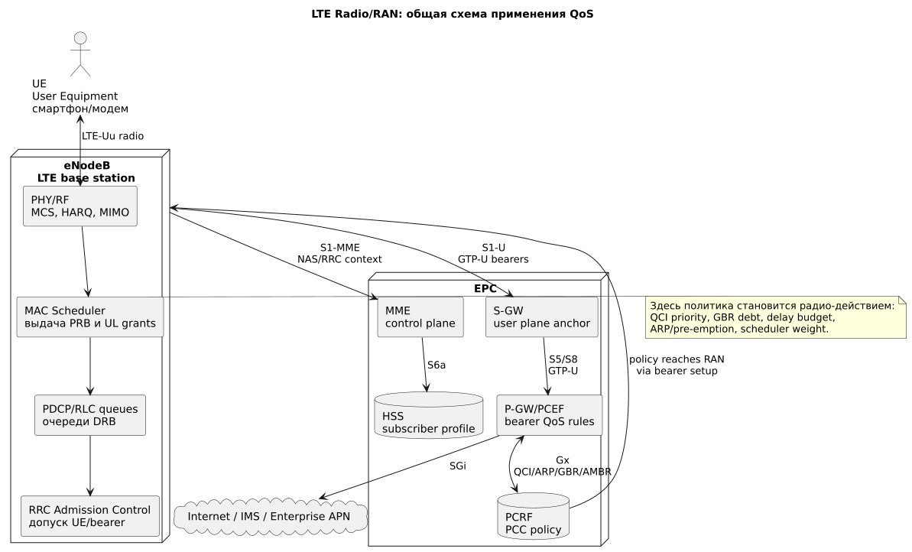
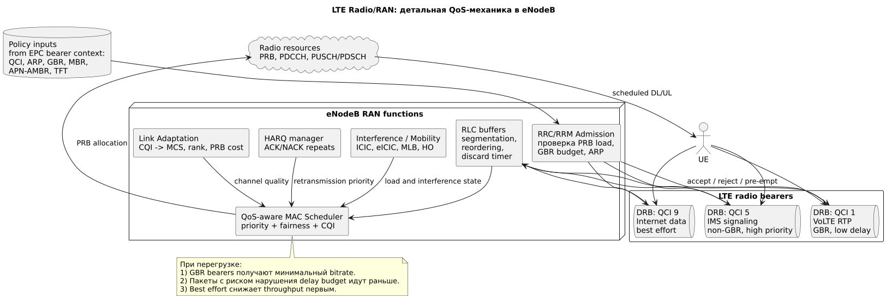

# LTE Radio/RAN: приоритизация в eNodeB

## Общая схема



Источник: [lte-radio-common.puml](diagrams/src/lte-radio-common.puml)

## Детальная схема



Источник: [lte-radio-private.puml](diagrams/src/lte-radio-private.puml)

## Роль блока

**LTE RAN (Long Term Evolution Radio Access Network)** — радиосеть LTE. Ее главный узел, **eNodeB (evolved NodeB)**, управляет радиоэфиром: выделяет ресурсы, принимает UE, применяет QoS на уровне радио и выполняет mobility.

Здесь политика качества становится физическим действием: eNodeB решает, какой **UE (User Equipment)** и какой bearer получит **PRB (Physical Resource Block)** в конкретный момент.

## Сокращения и зачем нужны

| Сокращение | Раскрытие | Зачем нужно |
|---|---|---|
| UE | User Equipment | Смартфон, CPE или модем абонента. |
| eNodeB | evolved NodeB | Базовая станция LTE, главный исполнитель RAN-политики. |
| RAN | Radio Access Network | Радиодоступ от UE до мобильного ядра. |
| RRC | Radio Resource Control | Подключение UE, настройка bearers, handover, admission. |
| RRM | Radio Resource Management | Управление радиоресурсами, интерференцией и mobility. |
| DRB | Data Radio Bearer | Радиоканал для пользовательских данных с QoS-профилем. |
| QCI | QoS Class Identifier | LTE-класс QoS: приоритет, задержка, loss, GBR/non-GBR. |
| GBR | Guaranteed Bit Rate | Гарантированная минимальная скорость для bearer. |
| MBR | Maximum Bit Rate | Верхний лимит скорости для bearer. |
| ARP | Allocation and Retention Priority | Допуск/удержание bearer и вытеснение при перегрузке. |
| PRB | Physical Resource Block | Базовая единица радиоресурса в LTE. |
| MAC | Medium Access Control | Планировщик ресурсов и HARQ. |
| RLC | Radio Link Control | Буферизация, сегментация, повторы на RLC-уровне. |
| PDCP | Packet Data Convergence Protocol | Шифрование, header compression, reordering. |
| HARQ | Hybrid Automatic Repeat Request | Быстрые повторы ошибочных радиоблоков. |
| CQI | Channel Quality Indicator | Оценка качества канала от UE для выбора MCS. |
| MCS | Modulation and Coding Scheme | Модуляция и кодирование, определяют бит/PRB. |
| ICIC/eICIC | Inter-Cell Interference Coordination / enhanced ICIC | Снижение межсотовой интерференции. |
| MLB | Mobility Load Balancing | Перевод UE между сотами/частотами для разгрузки. |

## Где применяются политики

| Точка | Что применяет | Как влияет на качество |
|---|---|---|
| RRC/RRM Admission Control | QCI, ARP, GBR, текущая загрузка PRB/PDCCH | Принимает или отклоняет новый bearer, защищает уже принятые GBR. |
| RLC buffers | DRB, discard timers, режим RLC | Разделяет очереди голоса, signaling и data, не дает voice стоять за bulk traffic. |
| MAC Scheduler | QCI priority, GBR debt, delay budget, CQI, fairness | Выдает PRB сначала критичным и задержко-чувствительным потокам. |
| HARQ/Link adaptation | CQI, MCS, retransmission state | Поддерживает надежность, но при плохом радио увеличивает расход PRB. |
| Mobility/RRM | load, interference, handover thresholds | Переносит UE на менее загруженный layer/cell. |

## Как гарантировать качество при перегрузке

Гарантия в LTE RAN строится по формуле:

```text
GBR bearer + Admission Control + ARP + QoS-aware Scheduler + достаточная емкость
```

Практические механизмы:

1. **Dedicated bearer для критичного сервиса.**  
   Например, **VoLTE (Voice over LTE)** получает QCI 1 для RTP-голоса и QCI 5 для IMS signaling. Это отделяет голос от обычного QCI 9 internet.

2. **GBR только для сервисов, где он действительно нужен.**  
   GBR для всех абонентов приведет к oversubscription. Хорошие кандидаты: VoLTE, emergency, MCPTT, industrial control, enterprise SLA.

3. **Admission Control.**  
   eNodeB не должен принимать новый GBR bearer, если соте нечем его обслужить. Иначе деградируют уже принятые сессии.

4. **ARP и pre-emption.**  
   Bearer с высоким ARP может быть принят при перегрузке и вытеснить менее важный bearer, если это разрешено политикой.

5. **QoS-aware MAC Scheduler.**  
   Scheduler учитывает QCI, delay budget, GBR debt, CQI и fairness. При перегрузке best effort получает меньше PRB первым.

6. **Резервирование или weighting ресурсов.**  
   Vendor-профили eNodeB часто позволяют задать веса scheduler, protected resources для VoLTE/critical traffic или ограничения для low-priority traffic.

7. **Load balancing и radio optimization.**  
   MLB, CA, ICIC/eICIC, antenna tilt, power tuning и neighbor optimization увеличивают фактическую емкость и снижают PRB cost для UE.

## Голос против data

Типовая LTE-иерархия:

```text
Emergency / public safety
  -> IMS signaling QCI 5
  -> VoLTE RTP QCI 1
  -> enterprise critical GBR
  -> premium non-GBR data
  -> default internet QCI 9
```

Голос защищается отдельным bearer, низким delay budget, высоким scheduler priority и admission control. Data-сеть обычно elastic: ее throughput снижается при congestion.

## Где хранится и как управляется конфигурация

| Конфигурация | Где хранится | Кто управляет |
|---|---|---|
| Radio scheduler profile, QCI mapping, admission thresholds | EMS/NMS/OSS vendor-системы eNodeB | RAN engineering / NOC |
| Neighbor list, HO thresholds, MLB, ICIC/eICIC | RAN OSS/SON | RAN optimization |
| Bearer QoS, QCI, ARP, GBR/MBR | PCRF/P-GW/MME context, приходит в eNodeB при bearer setup | Core engineering / BSS policy |
| Subscriber/APN eligibility | HSS и BSS/CRM | Provisioning / product team |

Важно: eNodeB не “придумывает” коммерческий приоритет абонента. Он получает QoS-контекст из core, а локальные RAN-профили определяют, как этот контекст превращается в PRB scheduling.
